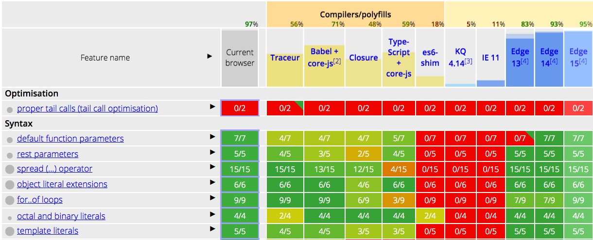

# ES-6

**NOTES:** everything here is based on my learning process, feel free to add suggestions if you find something strange.

## Lesson 4 - Professional Developer-fu

### 2 - Old and New Browsers

#### 2.1 - Code doesn't work in old browsers

The ES6 code is not supported in older browser.

Browser makers need to keep up with all of these changes. 

**But how do they know about these changes?**

[World Wide Web Consrotium (W3C)](https://www.w3.org/) is the standard body for things like HTML, CSS and SVG, [Ecma International](https://www.ecma-international.org/) is the industry that develops standards like Javascript and JSON. We can find the spesifications of ES6 [here](http://www.ecma-international.org/ecma-262/6.0/index.html).

#### 2.2 Further Info

Ecma International is an important industry community & definitely worth checking out in detail:
- [https://en.wikipedia.org/wiki/Ecma_International](https://en.wikipedia.org/wiki/Ecma_International)
- [http://www.ecma-international.org/memento/index.html](http://www.ecma-international.org/memento/index.html)

### 3 - ES6 Spesifications

Checking the specification (commonly shortened to "spec") for ES6 can be found [here](http://www.ecma-international.org/ecma-262/6.0/index.html). But maybe checking out to that cryptic wording might be difficult, so we recommend [Mozilla Developer Network](https://developer.mozilla.org/en-US/)

```
QUIZ QUESTION
Check out the ES6 Specification. Which section in the spec covers arrow functions?

- [ ] section 6
- [ ] section 10.3.2
- [x] section 14.2
- [ ] section 18.3.29
```

### 4 - Supported Features

With new language specifications coming out every year, and with browsers updating every other month, it can be quite challenging to know what browser supports which language features.
- Google Chrome - [https://www.chromestatus.com/features#ES6](https://www.chromestatus.com/features#ES6)
- Microsoft Edge - [https://developer.microsoft.com/en-us/microsoft-edge/platform/status/?q=ES6](https://developer.microsoft.com/en-us/microsoft-edge/platform/status/?q=ES6)
- Mozilla Firefox - [https://platform-status.mozilla.org/](https://platform-status.mozilla.org/)

> NOTE: Safari doesn't have it's own platform status website, but it uses Webkit - [https://webkit.org/status/](https://webkit.org/status/)

These can be a lot information to track down, we can use ECMAScript Compability Table built by [@kangax](https://twitter.com/kangax): 
- [http://kangax.github.io/compat-table/es6/](http://kangax.github.io/compat-table/es6/) 

<p align="center">
  
</p>

```
QUIZ QUESTION
Looking at the ECMAScript Compatibility Table, what kind of information does the first colored column display?

- [ ] The list of up-to-date browsers that support ES6. 
- [ ] The list of all ES6 features.
- [x] The status of all ES6 features supported by your current browser.
- [ ] Links to each browser platform's status for the specific ES6 feature.
```

### 7 - Using Polyfills

#### 7.1 - What is a polyfill?

> A polyfill, is a piece of code (or plugin) that provides the technology that you, the developer, expect the browser to provide natively.

Coined by [Remy Sharp](https://twitter.com/rem) - [https://remysharp.com/2010/10/08/what-is-a-polyfill](https://remysharp.com/2010/10/08/what-is-a-polyfill)

> We, as developers, should be able to develop with HTML5 APIs, and scripts can create methods and objects that should exist. From the HTML5 boilerplate team on polyfills - [https://github.com/Modernizr/Modernizr/wiki/HTML5-Cross-Browser-Polyfills](https://github.com/Modernizr/Modernizr/wiki/HTML5-Cross-Browser-Polyfills)

#### 7.2 - Further Research
[https://en.wikipedia.org/wiki/Polyfill](https://en.wikipedia.org/wiki/Polyfill)

#### 7.3 - An example of polyfill

The code below is a polyfill for the new ES6 String method `startsWith()`:

```
if(!String.prototype.startsWith) {
    String.prototype.startsWith = function(searchString, position) {
        position = position || 0;
        return this.substr(position, searchString.length) === searchString;
    }
}

'Udacity'.startsWith('Udac'); // returns `true`
'Udacity'.startsWith('Udac', 2); // returns `false`
'Udacity'.startsWith('ES6'); // returns `false`
```

It's just a regular javascript!

This is the example of the simple one, check the more robust one, [here](https://github.com/mathiasbynens/String.prototype.startsWith/blob/master/startswith.js).

```
QUIZ QUESTION
Why does the startsWith() polyfill begin with the following line?:

if (!String.prototype.startsWith)

- [ ] Without it, the script would throw an error.
- [ ] It checks to make sure the String.prototype exists.
- [x] It avoids overwritting the native startsWith method.
```

### 9 - Other Uses for Polyfills

Polyfill doesn't only patch up missing Javascript features, there are several polyfills out there for all sorts of browser features:
- SVG
- Canvas
- Web Storage (local storage / session storage)
- Video
- HTML5 elements
- Accessibility
- Web Sockets
- and many more!

For more complete list of polyfills, check out [this link](https://github.com/Modernizr/Modernizr/wiki/HTML5-Cross-Browser-Polyfills).

### 10 - Transpilling

> Compiler: computer program that takes a program written in some source code language, let's say C++, and converts it to a target langauge like machine code.

> Compiling: taking a source language and converting it into a lower level language.

Running code through compiler changes its level of abstraction, how close it is to human readable code, to machine runnable code.

> Transpilling: a subset of compiling. It takes source code and converts it into target code. 

Running code through transpiller, the target code are at the same level of abstraction. So it's still human readable.

This is a reasonable ways to convert our ES6 to ES5.

```
QUIZ QUESTION
To convert Java to JavaScript, would you use a compiler or a transpiler?

- [ ] a compiler
- [x] a transpiller
```

### 11 - Using Babel

A popular javascript transpiller, [Babel](https://babeljs.io/). 

It's original name was slightly more descriptive - 6to5. This was because, originally, Babel converted ES6 code to ES5. But now, it does a lot more, convert JSX to Javascript, convert Flow to Javascript.

Before we transpilling our code, lets check out this [Babel's REPL](https://babeljs.io/repl/#?babili=false&evaluate=true&lineWrap=false&presets=es2015).

```
class Student {
  constructor (name, major) {
    this.name = name;
    this.major = major;
  }

  displayInfo() {
    console.log(`${this.name} is a ${this.major} student.`);
  }
}

const richard = new Student('Richard', 'Music');
const james = new Student('James', 'Electrical Engineering');
```

#### 11.1 Transpilling project in repo

[Repo for this project](https://github.com/udacity/course-es6/tree/master/lesson-4/walk-through-transpiling), there's an ES6 directory that will be transpilled to ES5 code. 

The way Babep transform code from one language to another is through plugins.
- Plugins for arrow function ([ES2015 arrow function plugin](https://babeljs.io/docs/en/babel-plugin-transform-es2015-arrow-functions/))
- Plugins for template literals ([ES2015 template literals transform](https://babeljs.io/docs/en/babel-plugin-transform-es2015-template-literals/))
- [all full Babel's plugins](https://babeljs.io/docs/en/plugins/)

Now we can make our hands dirty by doing it on. There are several presets, but rather to make tou read a big chunk of list, we'll just use [ES2015 preset](https://babeljs.io/docs/en/babel-preset-es2015/)

After create a project, make sure to have the `.babelrc` file